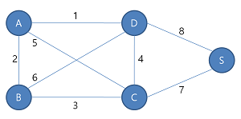

# 다익스트라 알고리즘
단일 출발지를 기준으로 각 정점까지의 최단 경로를 계산하는 알고리즘

간선의 가중치가 음의 값을 가지면 문제가 발생합니다.
이럴 때는 벨만-포드 알고리즘을 사용할 수 있습니다.

다익스트라 알고리즘의 기본적인 설명은 아래의 링크를 참고하면 좋을 것 같습니다.
[다익스트라 동영상](https://www.youtube.com/watch?v=tzUJ7GE1qVs)

## 간선에 가중치가 있는 그래프 준비
우리는 일전에 간선이 없는 단순한 [그래프](../../../data_structures/graph) 클래스를 만들어 보았습니다.
해당 그래프를 상속받아서 가중치가 있는 그래프를 먼저 만들어 보겠습니다.
간단하게 만들기 위해 그래프는 무방향성 그래프로 만들 예정입니다.
```javascript
export class Dijkstra extends Graph {
    constructor() {
        super();
    }

    /**
     * 가중치 추가
     * @param data1
     * @param data2
     * @param weight
     */
    addEdge(data1, data2, weight) {
        // 그래프에 저장된 각 정점의 인덱스를 준비합니다.
        const index1 = data1 instanceof Vertex ? this.findVertexIndex(data1.data) : this.findVertexIndex(data1);
        const index2 = data2 instanceof Vertex ? this.findVertexIndex(data2.data) : this.findVertexIndex(data2);
        // 그래프에 저장된 각 정점의 객체를 준비합니다.
        const obj1 = data1 instanceof Vertex ? data1 : this.findVertex(data1);
        const obj2 = data2 instanceof Vertex ? data2 : this.findVertex(data2);
        // 각 정점의 간선에 정점을 추가합니다.
        this.edges[index1].push(new Edge(obj2, weight));
        this.edges[index2].push(new Edge(obj1, weight));
    }
}
```

## 다익스트라 구현
먼저 우리는 아래와 같은 그래프를 기준으로 다익스트라 알고리즘을 구현할 예정입니다.


다익스트라 알고리즘을 구현하기 전에 아래와 같은 정보가 필요합니다.
* 시작 정점
* 시작 정점으로 부터 모든 정점까지의 최단 경로 및 길이를 저장할 배열

### 시작 정점 받기
저는 shortest라는 함수를 하나 만들고 매개변수로 시작점을 받도록 구현하겠습니다.
```javascript
class Dijkstra extends Graph {
    shortest(source) {
        let sourceIndex = this.findVertexIndex(source);
    }
}
```

### 정점간의 경로 정보 배열 생성 및 초기화
다음으로 입력받은 시작정점을 기준으로 그래프의 모든 정점간의 경로 정보를 담을 배열을 생성하고 값을 초기화를 하겠습니다.
경로 정보는 2가지의 값을 가지고 있습니다.
* 총 거리 : 시작정점 -> 시작정점은 당연히 0으로 초기화하면 됩니다. 시작정점 -> 다른정점은 현재는 얼마나 걸리는지 알 수 없으므로 Infinity로 초기화합니다.
* 경로 : 경로는 모두 빈 배열로 초기화합니다.

```javascript
class Dijkstra extends Graph {
    ...
    shortest(source) {
        ...
        /**
         * 출발점 'source'로부터 각 정점까지의 최단 경로를 나타내는 배열
         * 출발점과 동일한 정점은 0, 나머지는 Infinity로 지정한다.
         */
        const shortest = this.vertices.map((vertex, index) => {
            return {
                distance: index === sourceIndex ? 0 : Infinity, // 최단 경로의 거리
                path: [] // 최단 경로의 배열
            }
        });
    }
}
```

### 방문한 인덱스와 방문할 인덱스 관리 전략
위에 링크로 걸린 동영상을 보시면 수행시간이 어떤 자료구조를 사용하느냐에 따라서 수행시간이 다른 것을 보실 수 있습니다.
하지만 저는 특별한 자료구조를 사용하지 않고 시작정점을 시작으로 반복문을 수행하면서 방문가능한 정점에 대한 거리를 비교하면서 그 때마다 다음 방문할 인덱스를 선별하도록 하겠습니다.

다만 방문한 인덱스는 제외하기 위해 단순 일차원 배열은 사용하도록 하겠습니다.
```javascript
class Dijkstra extends Graph {
    ...
    shortest(source) {
        ...
        const visitedIndex = []; // 방문한 정점의 인덱스를 저장할 배열
        let currIndex = sourceIndex; // 현재 방문할 정점을 저장할 변수
        while (currIndex) { // 방문 시작
            ... // TODO. 방문한 정점으로부터 갈 수 있는 정점을 대상으로 시작정점과의 최단 거리를 분석
            currIndex = 다음 방문할 정점 지정
        }
    }
}
```

### 방문한 정점으로부터 갈 수 있는 정점을 대상으로 시작정점과의 최단 거리를 분석
현재 방문한 정점(currIndex)로부터 갈 수 있는 정점들(toIndex)을 대상으로 시작정점(sourceIndex)과의 최단 거리는 아래의 두가지 경우 중 더 작은 경로를 의미합니다.
1. 시작정점(sourceIndex)에서 특정 정점(toIndex)까지의 이미 저장된 경로(shortest)의 거리
1. 시작정점(sourceIndex)에서 현재 방문 정점(currIndex)까지의 거리와 현재 방문 정점(currIndex)에서 방문 가능 정점(toIndex)까지의 거리를 더한 거리

또한 시작정점(sourceIndex)로부터 방금 구해진 정점(toIndex)까지의 거리 중 가장 작은 거리를 가진 인덱스가 다음 방문할 정점(currIndex)으로 지정합니다.

글로만 설명하려니 역시 한계가 있습니다. 코드를 살펴보도록 하겠습니다.
```javascript
class Dijkstra extends Graph {
    ...
    shortest(source) {
        ...
        while (currIndex) { // 방문 시작
            visitedIndex[currIndex] = true; // 현재 정점을 방문 이력에 남깁니다.
            // 현재 정점에 연결된 정점에 대한 최단 거리 갱신
            let nextIndex = null; // 다음에 방문 예정인 인덱스를 임시로 저장할 변수를 준비합니다.
            // 현재 정점으로 부터 갈 수 있는 모든 정점을 탐색합니다.
            this.edges[currIndex].forEach( edge => {
                const toIndex = this.findVertexIndex(edge.dest);
                if (!visitedIndex[toIndex]) { // 이미 방문한 정점이면 무시하고 아직 방문전인 정점만 탐색합니다.
                    /*
                    1. shortest[toIndex].distance = sourceIndex에서 toIndex까지의 현재 저장된 거리
                    2. shortest[currIndex].distance = sourceIndex에서 currIndex까지의 현재 저장된 거리
                    3. shortest[currIndex].distance + edge.weight = currIndex를 경유하여 toIndex까지 가는 거리
                    1번과 3번 항목 중 1번 항목이 더 크다면 3번항목으로  1번 값을 변경한다.
                    */
                    if (shortest[toIndex].distance > shortest[currIndex].distance + edge.weight) {
                        shortest[toIndex].distance = shortest[currIndex].distance + edge.weight; // 거리 갱신
                        shortest[toIndex].path = shortest[currIndex].path.concat(toIndex); // 경로 갱신
                    }
                    /**
                     * 다음에 방문 예정인 인덱스가 아직 지정되지 않았거나
                     * 다음에 방문 예정인 인덱스까지의 거리보다 현재 분석한 정점까지의 거리가 더 짧다면
                     * 다음에 방문 예정인 인덱스를 현재 분석한 정점으로 지정한다.
                     */
                    nextIndex = !nextIndex || shortest[nextIndex].distance > shortest[toIndex].distance ? toIndex : nextIndex;
                }
            });
            currIndex = nextIndex; // 다음에 방문 예정인 인덱스를 확정한다.
        }
    }
}
```
반복문을 수행하다보면 결국 다음 방문할 인덱스가 null이 될 것이고 이로서 탐색은 마무리됩니다.